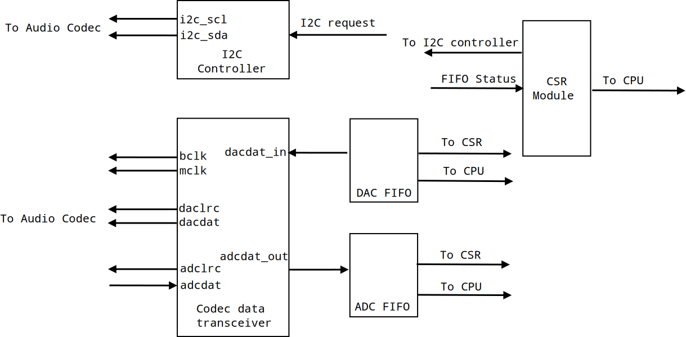
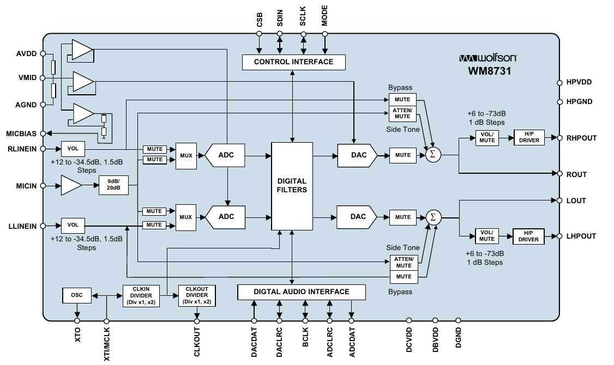
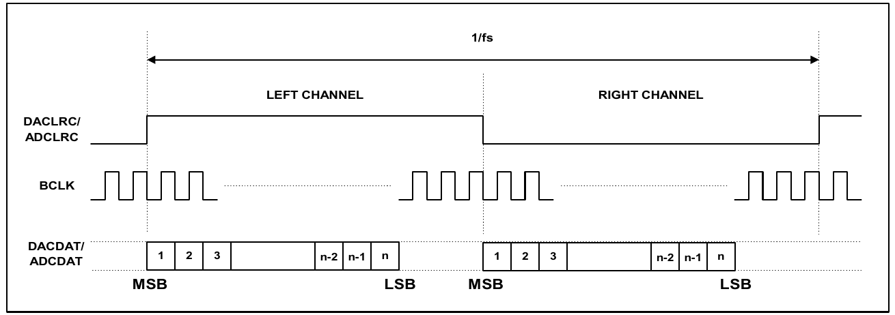
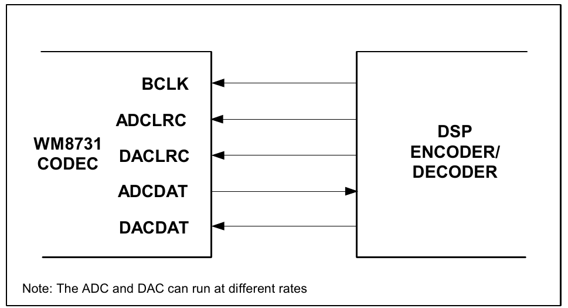

# Audio Controller

[TOC]

An audio controller for WM8731/WM8731L chip in DE2/DE1 FPGA board. 

> The architecture of this design is based on the book: *Embedded SoPC Design With NIOS II Processor and Verilog Example* by Pong Chu

## Version

Ver 1.0

## Supported Feature

1. Left-justified mode
2. Slave clocking mode (BCLK driven by FPGA)
3. Master clock rate of 12.288Mhz
4. Resolution of 16 bits
5. Sampling rate of 48K samples per second

## Design Specification

The Audio controller has 5 main module: I2C controller, Codec data transceiver, DAC FIFO, ADC FIFO, CSR module

### I2C Controller

I2C controller is used to configure the register in WM8731/WM8731L chip. See the spec for more details on the register configuration

### Codec data transceiver

Codec data transceiver is implement the Digital Audio Interface between the FPGA and WM8731/WM8731L chip. It read the serial ADC data from Audio Chip and output 16 bits parallel ADC data to the downstream buffer FIFO (ADC FIFO). It also read the the parallel DAC data from the upstream FIFO (DAC FIFO) and send the serial DAC data to Audio Chip. It also generate the bclk and mclk for the Audio Chip.

### DAC FIFO and ADC FIFO

The FIFO act as buffer between the downstream/upstream logic from FPGA/CPU and the Codec data transceiver.

### CSR module

Configuration and status register module. Provides configuration and status report for the CPU.

## WM8731/WM8731L Chip Introduction

> This section are mainly copied from the WM8731 / WM8731L datasheet.

The WM8731 or WM8731L (WM8731/L) are low power stereo CODECs with an integrated headphone driver. 

### Block Diagram

### Main Signal Description

| Name     | Type                 | Description                                     |
| -------- | -------------------- | ----------------------------------------------- |
| BCLK     | Digital Input/Output | Digital Audio Bit Clock                         |
| DACDAT   | Digital Input        | DAC Digital Audio Data Input                    |
| DACLRC   | Digital Input/Output | DAC Sample Rate Left/Right Clock                |
| ADCDAT   |                      | ADC Digital Audio Data Output                   |
| ADCLRC   |                      | ADC Sample Rate Left/Right Clock                |
| SCLK     | Digital Input        | 3-Wire MPU Clock Input / 2-Wire MPU Clock Input |
| SDIN     | Digital Input/Output | 3-Wire MPU Data Input / 2-Wire MPU Data Input   |
| XTI/MCLK | Digital Input        | Crystal Input or Master Clock Input (MCLK)      |

### Digital Audio Interface

WM8731/L may be operated in either one of the 4 offered audio interface modes.

- Right Justified
- Left Justified
- I2S
- DSP mode

The digital audio interface takes the data from the internal ADC digital filter and places it on the **ADCDAT** output. ADCDAT is the formatted digital audio data stream output from the ADC digital filters with left and right channels multiplexed together. ADCLRC is an alignment clock that controls whether Left or Right channel data is present on the ADCDAT lines. ADCDAT and ADCLRC are synchronous with the BCLK signal with each data bit transition signified by a BCLK high to low transition.

The digital audio interface also receives the digital audio data for the internal DAC digital filters on the **DACDAT** input. DACDAT is the formatted digital audio data stream output to the DAC digital filters with left and right channels multiplexed together. DACLRC is an alignment clock that controls whether Left or Right channel data is present on DACDAT. DACDAT and DACLRC are synchronous with the BCLK signal with each data bit transition signified by a BCLK high to low transition.

#### Left Justified Mode Timing Diagram

#### Digital Audio Interface Slave Mode

In Slave mode, the DSP/FPGA drives the clock to WM8731 codec

