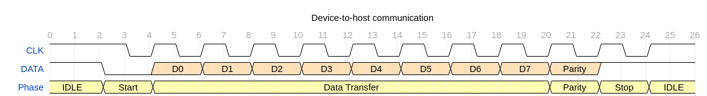

# PS2 Mouse/Keyboard Controller

- [PS2 Mouse/Keyboard Controller](#ps2-mousekeyboard-controller)
  - [Introduction](#introduction)
  - [Version](#version)
  - [Specification](#specification)
  - [Change Log](#change-log)
  - [PS2 Mouse/Keyboard Protocol Introduction](#ps2-mousekeyboard-protocol-introduction)
  - [Reference](#reference)

## Introduction

The PS2 Controller is designed to interface with the PS2 Interface.

## Version

Ver 1.0

## Specification

The PS2 controller 1.0 version implements the PS2 receiver path. (transmit path not implemented yet).

It has the following feature:

1. Receives the data from the device.
2. Provides a FIFO buffer with default 16 locations to hold the receiving data.
3. Generate interrupt signal when FIFO is not empty.

### Register Space

[PS2 CSR Document](../csr/ps2_csr/doc/ps2_csr.html)

## Change Log

- 10/31/2020 - Version 1.0: Initial version created.

---

## PS2 Mouse/Keyboard Protocol Introduction

*This section is mainly copied from: [The PS/2 Mouse/Keyboard Protocol](http://www-ug.eecg.utoronto.ca/desl/nios_devices_SoC/datasheets/PS2%20Protocol.htm)*

The PS2 protocol is a series interface. The main interface has 2 lines. A data line and a clock line. Both lines are open-collector with a pull up resistor to Vcc.

### Communication

The PS/2 mouse and keyboard implement a bidirectional synchronous serial protocol. The bus is "idle" when both lines are high (open-collector). This is the only state where the keyboard/mouse is allowed begin transmitting data. The host has ultimate control over the bus and may inhibit communication at any time by pulling the Clock line low.

The device always generates the clock signal.  If the host wants to send data, it must first inhibit communication from the device by pulling Clock low.  The host then pulls Data low and releases Clock.  This is the "Request-to-Send" state and signals the device to start generating clock pulses.

Bus State Summary

| Data | Clock | State                |
|------|-------|----------------------|
| High | High  | Idle                 |
| High | Low   | Communication Start  |
| Low  | High  | Host request-to-send |

All data is transmitted one byte at a time and each byte is sent in a frame consisting of 11-12 bits.

- 1 start bit.
- 8 data bits, least significant bit first.
- 1 parity bit (odd parity).
- 1 stop bit. This is always 1.
- 1 acknowledge bit (host-to-device communication only)

Data sent from the device to the host is read on the falling edge of the clock signal.  
Data sent from the host to the device is read on the rising edge.  
The clock frequency must be in the range 10 - 16.7 kHz.

#### Device-to-Host Communication

The Data and Clock lines are both open collector. A resistor is connected between each line and +5V, so the idle state of the bus is high. When the keyboard or mouse wants to send information, it first checks the Clock line to make sure it's at a high logic level. If it's not, the host is inhibiting communication and the device must buffer any to-be-sent data until the host releases Clock. The Clock line must be continuously high for at least 50 microseconds before the device can begin to transmit its data.  

## Reference

- [The PS/2 Mouse/Keyboard Protocol](http://www-ug.eecg.utoronto.ca/desl/nios_devices_SoC/datasheets/PS2%20Protocol.htm)

- [The PS/2 Keyboard Interface](http://www-ug.eecg.toronto.edu/msl/nios_devices/datasheets/PS2%20Keyboard%20Protocol.htm)

- *Embedded SoPC Design With NIOS II Processor and Verilog Example* by Pong Chu.