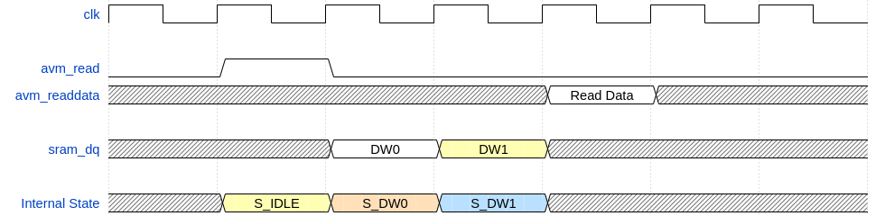
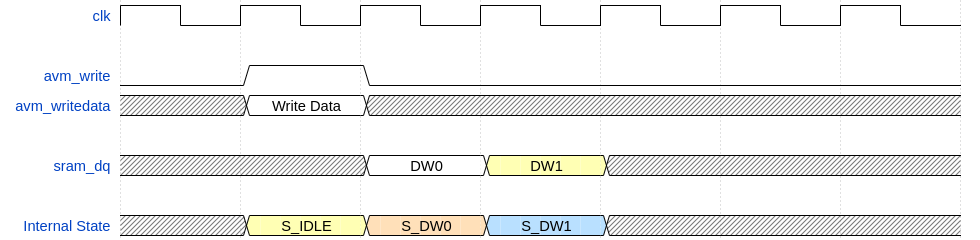

# Avalon Mapped SRAM Controller

- [Avalon Mapped SRAM Controller](#avalon-mapped-sram-controller)
  - [Introduction](#introduction)
  - [Version](#version)
  - [Specification](#specification)
  - [Timing Diagram](#timing-diagram)
  - [Change Log](#change-log)

## Introduction

The Avalon Memory SRAM controller IP is designed for the SRAM chip Terasic DE1/DE2 FPGA board.

The SRAM chip used in the DE1/DE2 FPGA board is **IS61LV25616** from ISSI.

## Version

Ver 2.0

## Specification

1. This IP supports fixed 32 bit data width

2. Both the Avalon interface and the SRAM interface are registers to improve timing. (But introduced additional latency)

3. Read latency: 3 clock cycle. Write latency: 3 clock cycle

4. The input address from avalon mm interface is byte address and it should be 4 byte (32 bit) aligned. The IP does not check if the address is byte aligned or not. Wrong address may result in wrong data being read/write.

5. The output address to SRAM in the word address and each work is 16 bits. (The size of the SRAM) 

## Timing Diagram

### Simple Read operation

### Simple Write operation

## Change Log

- 10/10/2020: Revision 2.0

- 10/07/2020: Revision 1.0 - Initial Version.
